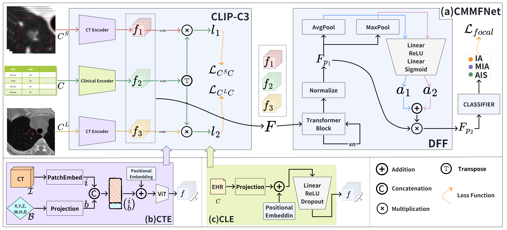
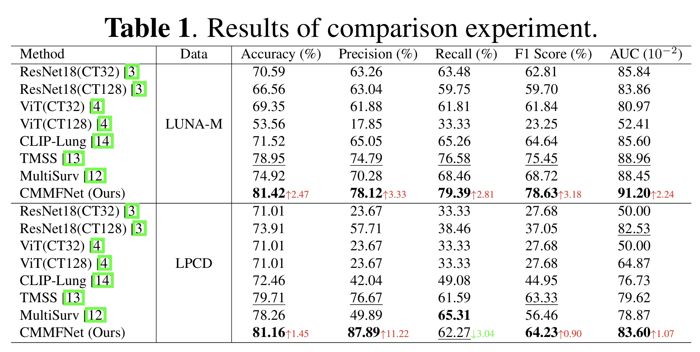
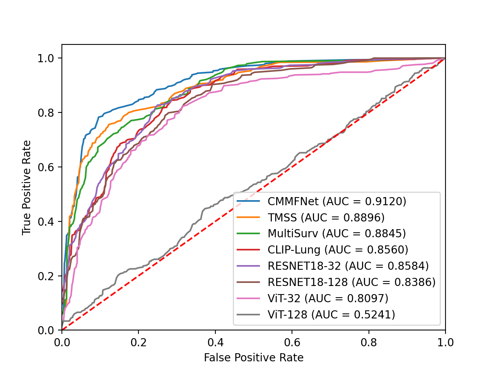
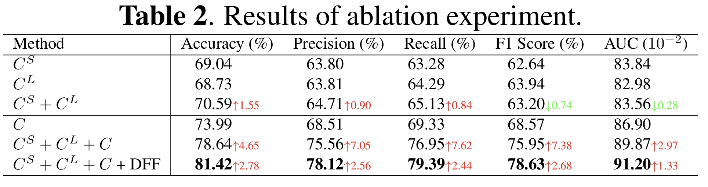

# Deep Neural Network for Staging Adenocarcinoma via Multimodal Fusion of Lung CT Images, Coarse Annotation Bounding Boxes, and Electronic Health Records

Our model achieves a superior accuracy of 81.42\% and an area under the curve of 0.9120 on the validation set, significantly outperforming other recent multimodal classification methods.

## Datasets
**The private LUNA-M dataset** collected from the Cancer Hospital & Shenzhen Hospital (Shenzhen, China). This dataset comprises 1,614 cases of lung adenocarcinoma from 1,430 anonymized patients, with each case including CT scans, clinical data, and bounding boxes identifying tumor locations. The cases are categorized into IA, MA, and AIS, with class proportions of 53.5\%, 24.1\%, and 22.4\%, respectively.

**The open-source LPCD dataset** derived from [Lung-PET-CT-Dx](https://doi.org/10.7937/TCIA.2020.NNC2-0461), contains the same modalities as LUNA-M. It includes 342 lung cancer cases, categorized into adenocarcinoma, small cell carcinoma, large cell carcinoma, and squamous cell carcinoma. Due to the limited squamous cell cases, the large and squamous cell categories are merged, resulting in a three-class dataset with distributions of 70.7\%, 17.3\%, and 12.0\%, respectively. 

## Results
In experiments on the LUNA-M and LPCD datasets, our method consistently outperformed other competing methods, as shown in Table1.  

The ROC curves comparing CMMFNet with other methods are shown in Fig2, where our method achieves the most favorable curve position, demonstrating superior discriminative capability across various classification thresholds.

To evaluate the effectiveness of each module, we conducted ablation studies on the LUNA-M dataset.

## Start
train: `python train_clip.py --lr 0.001 --batch-size 24 --epochs 200 --phase train`

eval: `python train_clip.py --lr 0.001 --batch-size 24 --epochs 200 --MODEL-WEIGTH model.pt --phase val`

## Acknowledgements
This work was supported by the Zhejiang Provincial Natural Science Foundation of China (No.LY21F020017, 2022C03043), GuangDong Basic and Applied Basic Research Foundation (No.2022A1515110570), Innovation Teams of Youth Innovation in Science and Technology of High Education Institutions of Shandong Province (No.2021KJ088), Shenzhen Science and Technology Program (No.KCXFZ20201221173008022). 